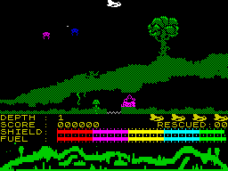
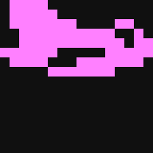
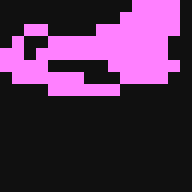
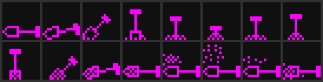
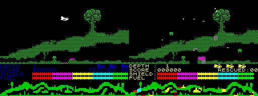

# Subterranean Stryker — Reverse Engineering & C# Port

[](LICENSE)
[](https://dotnet.microsoft.com/)
[](https://avaloniaui.net/)

A clean-room-ish reverse engineering project that takes the 1985 ZX
Spectrum game **Subterranean Stryker** (Insight Software — code by
Mark Wilson & Peter Gough, music by Tim & Mike Follin) and rebuilds
it as a portable, cross-platform C# program with a hand-written Z80
emulator, a complete reverse-engineering toolkit, and an
asset/sprite viewer.

Every line of code in this repository is hand-written — no
third-party Spectrum emulator, no third-party Z80 disassembler, no
third-party imaging library. The point isn't just to reach a
working port; it's to make it possible for a single reader to
follow every line of code from "load a snapshot" to "render the
game".

<p align="center">
  
</p>

---

## What works today

### A live, playable game

A hand-written Z80 emulator, plus a 48 K Spectrum host (RAM + ROM +
ULA), inside an Avalonia 12 window. The original 1985 binary boots,
runs, and accepts input on macOS, Linux, and Windows.

<p align="center">
  
  
  
</p>

```sh
dotnet run --project src/Subterra.Game
```

* **Q / A** — thrust up / thrust down (it's a space ship — free
  flight in all four directions)
* **L** — move horizontally
* **Enter** — fire
* **1 / 2 / 3 / 4** on the title screen pick a control method
  (KEYBOARD / Interface 2 / Kempston / Cursor)
* **Esc** quits

### A complete reverse-engineering toolkit

A `subterra` CLI with 12 sub-commands covering snapshot decoding,
Z80 disassembly, memory inspection, opcode-pattern search, live
emulator runs with scripted key input, RAM dumps, sprite extraction,
and instruction-level execution tracing. The full reference lives in
[**docs/TOOLS.md**](docs/TOOLS.md). Highlights:

* `render-snapshot` and `render-scr` decode Spectrum screens to PNG.
* `disasm` reads any region of a snapshot as Z80 mnemonics.
* `find-bytes` greps for an opcode pattern with wildcards.
* `run-emu` boots the game in the emulator, scripts key presses by
  frame number, and saves the final screen and RAM dump.
* `scrwrite-trace` logs every screen-memory write during a single
  gameplay frame, with PC, address, byte value, and `(x, y)`.
* `sprite-scan` interprets a memory region as a grid of 8 × 8 (or
  any size) cells and writes a contact-sheet PNG for each window.

### Three asset banks already extracted

<p align="center">
  
  &nbsp;&nbsp;
  
  <br/>
  <em>The <strong>player Stryker</strong> — two 16-byte directional
  frames (right and left), 16 × 8 pixels each, sourced from
  <code>$E63B</code> / <code>$E64B</code> and drawn by the
  dedicated XOR routine at <code>$DCF5</code>. The XOR drawing is
  exactly why the ship flickers in-game — same call erases and
  redraws, with a gap in between. See
  <a href="docs/RE-LOG.md#17-the-player-stryker-has-its-own-draw-path">RE-LOG §17</a>.</em>
</p>

<p align="center">
  <br/>
  <em>Entity type 0 at <code>$B8F4</code> — turns out this is the
  <strong>workers' digging-tool animation</strong> (pickaxe / shovel
  heads swung in 16 frames, with dirt particles), <em>not</em> the
  player. The whole entity-type table at <code>$F5A0</code> is full
  of monsters and decor (lava, stalactites, falling rocks, spiders,
  bubbles, mine carts, …); the Stryker has its own dedicated draw
  path. We mis-identified type 0 as the player at first; the user
  corrected us — see <a href="docs/RE-LOG.md#17-the-player-stryker-has-its-own-draw-path">RE-LOG §17</a>.</em>
</p>

### Two more asset banks already extracted

<p align="center">
  <br/>
  <em>The 21 cave-terrain UDGs at <code>$E62B</code> (8 × 8 each).</em>
</p>

<p align="center">
  <br/>
  <em>The master 8 × 8 sprite tile bank at <code>$B0F4</code>
  (≈ 390 tiles, decoded with <code>subterra sprite-scan</code>).
  Cave walls, trees, buildings, the "RESCUED" people figures,
  projectiles, and the HUD font (you can spot F-U-E-L in there).</em>
</p>

### An interactive asset viewer

```sh
dotnet run --project src/Subterra.Editor
```

Avalonia GUI that auto-loads either the bundled snapshot or a
post-game RAM dump and lets you scroll through memory at any cell
size. Preset buttons jump to the tile bank, UDGs, music data, etc.
Hovering a cell shows its address and raw bytes; "Save PNG" writes a
clean contact sheet into `renders/`.

---

## How it was built

The story of the reverse engineering — every dead end included — is
in [**docs/RE-LOG.md**](docs/RE-LOG.md). The lookup table of every
named address we've identified is in
[**docs/MEMORY-MAP.md**](docs/MEMORY-MAP.md). The two are kept in
lockstep; every "found new routine" commit touches both.

A few highlights from the journey:

* **The master tile bank at `$B0F4`** was found by tracing back
  from `LD DE,$4000` (the routine writing the *screen* address) to
  the inner draw helper at `$DAF2`, where the indirection
  `index → $B0F4 + index*8` jumped out. See
  [RE-LOG §14](docs/RE-LOG.md).
* **Flicker and colour clash are by design.** Subterranean Stryker
  draws its moving sprites with an XOR routine at `$E1DE` — same
  call erases and draws, with a gap in between. And colour is
  stored in 32×24 attribute cells, so a sprite passing near an
  enemy briefly shares its 8×8 colour. Both are intrinsic
  Spectrum-hardware behaviour, faithfully reproduced. See
  [RE-LOG §12](docs/RE-LOG.md).
* **A forty-year-old Star Wars easter egg.** The idle title screen
  draws a HALL OF FAME (`$FCDB`) whose default high-score names at
  `$FE0F` are *Red Squadron pilots*: "somebody", **Wedge**,
  **Biggs**, "John D.", **Luke**, **Porkins** — plus "Timothy"
  and "Gof", almost certainly Tim Follin and Peter Gough signing
  their work. As far as we can tell, nobody had spotted it in
  the data before. See
  [title-menu.md](docs/disasm/title-menu.md) and
  [RE-LOG §59](docs/RE-LOG.md).
* **The bitmap IS the collision system.** Nothing in this game
  ever compares coordinates for damage: the player takes hits
  when his XOR-draw lands on non-zero pixels (`$DCF5`), and
  enemy ships/the boss DIE when their own draw finds the laser
  beam pattern `$EF` under them (`$E9F0` — including a kill
  jingle and an 8-particle explosion). We got this wrong once
  ("the laser hits nothing") before finding the check hiding in
  the *targets'* blitter — the correction story is in
  [RE-LOG §62](docs/RE-LOG.md) and [laser.md](docs/disasm/laser.md).
* **Level 0 is a bug.** The level-0 record pointer sits 3 bytes
  out of alignment — the page after level 5 would draw garbage
  and corrupt RAM ([entities.md](docs/disasm/entities.md)). The
  port wraps 5 → 1 instead.

---

## Repository layout

```
original/        original 1985 game files + 48 K Spectrum ROM
  tape/          the .tzx tape image
  dumps/         the .z80 snapshot + SCR loading screen
  rom/           48k.rom (with provenance note)
src/             everything we wrote, one .NET 10 solution
  Subterra.Spectrum/   snapshot loader, Z80 CPU, ULA, screen, PNG
  Subterra.Assets/     SpriteSheet decoder, RenderedImage
  Subterra.Tools/      the `subterra` CLI — 12 sub-commands
  Subterra.Game/       Avalonia window — playable emulator
  Subterra.Editor/     Avalonia asset viewer
docs/
  RE-LOG.md      the running notebook (read top-to-bottom)
  MEMORY-MAP.md  every named address, organised by RAM region
  TOOLS.md       every tool with what / why / how-to
assets/extracted/
  tiles-b0f4.bin first standalone asset file (3 KB tile bank)
renders/         timestamped PNG history of every render the
                 project has ever produced — kept forever as a
                 visual changelog
```

---

## Quick-start

Requires **.NET 10 SDK**. No other tooling required.

```sh
# 1. Build the whole solution
dotnet build SubterraneanStryker.slnx

# 2. Play the original game in our emulator
dotnet run --project src/Subterra.Game

# 3. Browse memory / assets with the GUI viewer
dotnet run --project src/Subterra.Editor

# 4. Use the CLI — print all available commands
dotnet run --project src/Subterra.Tools -- --help

# Examples of CLI use ------------------------------------------------

# Render the original loading screen
dotnet run --project src/Subterra.Tools -- \
    render-scr original/dumps/SCRSHOT/SUBSTRYK.SCR

# Render the snapshot's screen memory (= title screen)
dotnet run --project src/Subterra.Tools -- \
    render-snapshot original/dumps/SUBSTRYK.Z80

# Disassemble the main game entry point
dotnet run --project src/Subterra.Tools -- \
    disasm original/dumps/SUBSTRYK.Z80 F5FD 30

# Boot the game, drive it via scripted keys, dump RAM for the Editor
dotnet run --project src/Subterra.Tools -- \
    run-emu original/rom/48k.rom original/dumps/SUBSTRYK.Z80 600 \
    -keys=5-10:SPACE,40-50:1,200-500:A \
    -ram=build/post-game.bin

# Extract the in-game UDG cave tiles from the RAM dump
dotnet run --project src/Subterra.Tools -- \
    sprite-scan build/post-game.bin E62B E700 8x8 \
    -cols=8 -count=21 -scale=6
```

See [docs/TOOLS.md](docs/TOOLS.md) for the full reference of every
CLI command, every public class in the runtime library, and every
GUI feature.

---

## Generated files (what's in the repo vs what you build locally)

A few intermediate files appear in commands and in the Editor's
auto-load path but are *not* committed — they're cheap to
regenerate, and pinning them in git would just create churn. Here's
exactly where each one comes from.

### `build/post-game.bin` — 48 K RAM dump captured mid-gameplay

The boot-time snapshot (`original/dumps/SUBSTRYK.Z80`) captures the
game *waiting on PAUSE 0*, before its own initialisation has run.
That means the master tile bank at `$B0F4` and the in-game UDGs at
`$E62B` are not yet populated. To see those banks we have to run the
game past its init code and dump RAM at that point.

```sh
mkdir -p build
dotnet run --project src/Subterra.Tools -- \
    run-emu original/rom/48k.rom original/dumps/SUBSTRYK.Z80 600 \
    -keys=5-10:SPACE,40-50:1,200-500:A \
    -ram=build/post-game.bin
```

Reading the `-keys=` line: press **SPACE** during frames 5..10 (to
break out of `PAUSE 0` on the boot screen), press **1** during
frames 40..50 (to pick the KEYBOARD control option), then press
**A** for frames 200..500 (to fly the ship through the level).
After 600 frames we save the full 48 K of
Spectrum RAM as a flat binary, `build/post-game.bin`.

The Editor (`dotnet run --project src/Subterra.Editor`) checks for
this file at start-up and uses it if present, so the **Tile bank
($B0F4)** and **Cave UDGs ($E62B)** preset buttons render real
content. If the file is missing, the Editor falls back to the boot
snapshot — those banks just look like zeros.

### `assets/extracted/tiles-b0f4.bin` — 3 KB master tile bank

A 3 072-byte slice of the post-game RAM dump containing the master
8 × 8 tile sheet at `$B0F4..$BCF3`. Committed (small, useful), but
you can regenerate it from the RAM dump above with:

```sh
dd if=build/post-game.bin of=assets/extracted/tiles-b0f4.bin \
   bs=1 skip=$((0xB0F4 - 0x4000)) count=3072
```

### `renders/*.png` — visual changelog

Every PNG rendered by *any* tool in the project goes here, with a
timestamp suffix so the directory acts as a history. Examples:

* `subterra render-scr file.scr` → `renders/scr-<name>_<ts>.png`
* `subterra render-snapshot file.z80` → `renders/snapshot-<name>_<ts>.png`
* `subterra run-emu ...` → `renders/emu-<name>-f<NNNNN>_<ts>.png`
  (and one per `-stride` frame if you ask for a sequence)
* `subterra sprite-scan ...` → `renders/scan-$<addr>-<WxH>_<ts>.png`
* The Editor's **Save PNG** button → `renders/sprites-$<addr>-...`

These *are* committed — they're the project's visual changelog,
intentionally kept so a reader can scroll back and see how the
understanding of an asset evolved.

### `bin/` and `obj/` — .NET build output

Gitignored, fully regenerable via `dotnet build`. You should never
need to look in here.

---

## The native port

A **second, emulator-free C# port** lives alongside the
Avalonia-wrapping `Subterra.Game`.  It's in [`native/`](native/) —
a standalone three-project solution
([`SubterraCS.slnx`](native/SubterraCS.slnx)) with a hand-rolled
SDL2 wrapper (~250 LoC of P/Invokes, no NuGet packages), the four
sprite-blitters ported as C# methods, the entity / spawn / level
systems re-implemented natively, and a **procedural level
generator** that takes over once the original's six pages have
been exhausted.  As of RE-LOG §55, every gameplay subsystem from
level-load through death has been disasm'd, documented in
[`docs/disasm/`](docs/disasm/), and ported faithfully — verified by a
0% diff-vs-emu at f100 and f300 (title + early frames).

<p align="center">
  <br/>
  <em>EMU (left) vs native C# port (right) at the same level-1
  gameplay state.  Same cave silhouette, tree, hill profile, and
  HUD bars — produced by completely independent code paths: a
  Z80 running the 1985 binary on the left, ~1.5k lines of game
  C# on the right.</em>
</p>

Recent native port milestones (full narrative in
[`docs/RE-LOG.md`](docs/RE-LOG.md), per-subsystem ASM traces in
[`docs/disasm/`](docs/disasm/)):

- **Damage** ([damages.md](docs/disasm/damages.md)) — `$DCF5`
  XOR-overlap shadow-carry flag is the cassette's PRIMARY damage
  trigger; `$DD4D` coord walker is INSTANT-DEATH; `$DDC4` has no
  per-hit invincibility.  Port has all three ($DCF5 + $EB7A/$EDC0
  address-match + $DD4D coord walker), with the artifact
  `SetInvincible(20)` cooldown removed.
- **Spawn-in + slide-in** ([spawn-in.md](docs/disasm/spawn-in.md))
  — `$DB1A` 16-row scroll-and-paint slide-in, `$E135` dots-converge
  (8 particles, 40 frames), correct level-start sequencing per
  `$F6F2..$F6CB` and respawn loop at `$F6C7..$F6EF`.  Particles
  drawn as 2×2 pixel XOR blocks (port of `$E1C0`'s 4-corner
  `$E1DE` calls), not the full 8×8 attribute cell my first pass
  used.
- **Assets** ([assets.md](docs/disasm/assets.md)) — full
  inventory of every byte in `assets/extracted/`: cassette
  address, byte layout, consumer, port loader.  Per-level
  cave colour wired through `level-speed-e57c.bin` (each level
  now has its own attribute byte — white, green, magenta,
  yellow, red, blue).
- **Shift precision modifier (port-only)**
  ([input.md](docs/disasm/input.md) §"Port-only addition") — hold
  Shift while pressing Q/A/L for edge-triggered single-step
  movement.  Vertical = 1 px altitude per edge.  Horizontal = 1
  px scroll per edge via a post-shift over the whole playfield
  bitmap so workers + ships + bullets all stay anchored to the
  cave during sub-pixel scrolling.  The cassette has no
  equivalent (`$DA23`/`$DA62` are byte-aligned at 8 px/frame).

```sh
cd native
dotnet run --project SubterraCS.Game           # interactive SDL2 mode
dotnet run --project SubterraCS.Game -- --headless --frames=600   # headless test
```

Controls (native port):

- **Q / A** — thrust up / down
- **L** — scroll horizontally in current facing
- **Left / Right** — face left / right + scroll
- **Enter / Space** — fire
- **1–5** on the title screen — pick a control option and start
  (like the original menu)
- **Shift** (port-only) — precision modifier: each direction key
  fires ONE pixel per press-edge instead of accelerating
- **F11** — toggle fullscreen, **P** — pause, **R** — reset,
  **Esc** — quit

All movement/fire keys are **remappable**: the first interactive
run writes a commented `keymap.cfg` template at the repo root —
edit it and restart.  One action per line
(`fire = enter, space`); actions left out keep their defaults;
system keys (Esc/P/R/F11/digits) stay fixed so a broken config
can't lock you out.

## Is a full C# port realistic?

Yes — **two to three weeks of focused work**, given everything we
already have. See [`docs/FEASIBILITY.md`](docs/FEASIBILITY.md) for
the honest breakdown:

* The game's data is ~15 KB total: master tile bank (3 KB),
  entity sprite banks (8 KB), music data (4 KB), level schedules
  (192 B), tables (~200 B more). All extracted.
* The game's code is ~10 KB, with every major routine mapped in
  [`docs/MEMORY-MAP.md`](docs/MEMORY-MAP.md).
* The **level "design" is 192 bytes** — 6 levels × 32 bytes per
  level (8 timed enemy spawns). No tile maps, no compressed
  terrain. The hazards are procedurally composed by the entity
  system as the ship flies through.

The largest remaining work is the 16+ per-enemy AI behaviours;
everything else (renderer, blitters, dispatcher, player, audio)
is straightforward and well-mapped. The Z80 emulator we already
have stays in the repo as the reference oracle for parallel-run
verification during the port.

## Roadmap

Known open follow-ups, parked rather than blocking.  (Earlier
roadmap items — beeper audio, native game logic, sprite/level
format decoding — are done; see
[docs/disasm/sound.md](docs/disasm/sound.md), the
[native port section](#the-native-port), and
[docs/disasm/assets.md](docs/disasm/assets.md).)

* **Follin player port.** The native runner now plays the REAL
  cassette SFX (captured to WAV by `subterra sfx-render` — see
  [sound.md](docs/disasm/sound.md)), but continuous in-game music
  still comes from the simple `MusicPlayer` synth. A pure C# port
  of the `$5E88` Follin player consuming `music-5e88.bin` would
  bring the looping tunes natively — big job, T-state-sensitive
  PWM code.
* **`warning`/`gameover` SFX context.** Two of the cassette's
  queued sound messages stay silent in the `sfx-render` harness
  (they queue without entering the player); their exact in-game
  trigger context is still TBD.
* **Hall of Fame name entry.** The native port now shows the
  `$FCDB` idle-title HALL OF FAME (Star Wars defaults included)
  and persists scores to `hiscores.cfg` — but inserted entries
  are named "PLAYER"; an on-screen name-entry keyboard would
  finish the feature.

(Closed since this list was last trimmed: level-0 decoded — it's
a data bug in the original, port wraps 5 → 1; the laser-kill
mechanism found in `$E9F0` — the targets' own draw checks for the
beam pattern; entities proven stationary via the full `$F1EF`
trace; native title menu honours keys 1–5; the Editor gained a
Map tab that can edit level tiles; authentic cassette SFX play in
the native port.)

---

## Acknowledgements

This project sits squarely on top of forty years of work by other
people. Every choice we got to make — what to extract, where to
look, which opcode is which, what a flag bit means — was already
documented somewhere, by someone who didn't have to. **None of this
would have been possible without them**, and it feels important to
name a few groups explicitly:

**The original team.** *Mark Wilson* and *Peter Gough* wrote
Subterranean Stryker; *Tim* and *Mike Follin* wrote its music.
Tearing apart somebody's 1985 Z80 code 40 years later only makes
sense if you keep in mind that real people designed it, with real
constraints, and real cleverness. Some of the tricks we re-discovered
(the three parallel draw paths, the chunky 2×2 XOR sprites, the
`($5C36)`-points-to-ROM-font HUD font, the level-page scroll
gate at `$E584`) are small jewels of mid-80s programmer thinking.

**Sinclair Research, Amstrad, Sky-In-One Ltd.** The ZX Spectrum is
forty years old and still legible because Amstrad
[granted permission](original/rom/README.md) in 1999 for the 48 K /
128 K ROMs to be freely redistributed for non-commercial use. Our
emulator boots from that ROM, unmodified.

**Zilog**, for publishing the *Z80 CPU User Manual*. Every flag
edge case in our `Z80Cpu` traces back to a paragraph in that book —
flag-correct ALU, the family of CB / ED / DD / FD prefixes, the
auxiliary registers, the IM 0 / 1 / 2 modes.

**The Spectrum preservation community**, in particular *World of
Spectrum* (worldofspectrum.org and worldofspectrum.net), *Spectrum
Computing* (spectrumcomputing.co.uk), *Everygamegoing*, the *Sinclair
Wiki* (sinclair.wiki.zxnet.co.uk), *Philip Kendall*, and the MDFS
ROM-images mirror. They are the reason a 1985 cassette and its
loading screen are still available in 2026 in pristine, documented
form. The `original/` directory of this repository is borrowed from
their work; we will take any of it down if asked.

**The .z80 snapshot format**, designed by *Gerton Lunter* for the
original Z80 emulator and adopted as a de-facto preservation
standard. Our `Z80SnapshotReader` follows the spec he documented
(via the community-mirrored `z80.txt`) — v1, v2 and v3 forms.

**Decades of Spectrum hardware lore.** The interleaved bitmap
address layout, the 32 × 24 attribute grid + colour-clash, the
ULA's port `$FE` keyboard half-row encoding, the FRAMES counter at
`$5C78`, the UDG pointer at `$5C7B`, the 50 Hz interrupt timing,
the printer-buffer / system-variables / channel-area layout — all
of these are knowledge that exists because someone, somewhere,
once wrote it down and kept it findable. Sites like Sinclair Wiki
and the various Spectrum FAQs collected on Usenet and re-mirrored
ever since are the substrate this project floats on.

**Every author of every previous Z80 emulator and disassembler.**
We deliberately didn't read other Spectrum-emulator source code
while writing ours — not because they're bad, but because the
project's premise is "do it ourselves so we understand it". But
their *existence*, and the years of bug reports and test cases they
generated, set the bar for what "correct" means and gave us the
oracle we needed when our emulator misbehaved.

If any of the above are reading this and feel under-credited or
mis-attributed, please open an issue — getting the acknowledgements
right matters.

## Legal

The original 1985 game is © Insight Software. The tape image, the
snapshot, and the loading screen under [`original/`](original/) are
widely mirrored across preservation archives (World of Spectrum,
Spectrum Computing). Nothing here is sold, and the binaries are kept
only for reverse engineering and historical preservation. Insight
Software (or any current rights holder) can ask for the binaries to
be removed at any time.

The 48 K Spectrum ROM under [`original/rom/`](original/rom/) is
© Amstrad plc, redistributed under [Amstrad's 1999 permission grant
for non-commercial use](original/rom/README.md).

All hand-written code (tools, runtime library, GUI apps,
documentation) is licensed under the MIT License —
see [`LICENSE`](LICENSE).

— John Knipper, `<code@jkn.me>`
