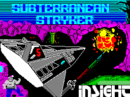
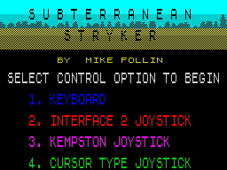
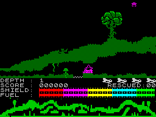

# Reverse Engineering Log

A running notebook of what we discover as we tear the game apart. New
entries are appended; older entries are not edited (except for fixing
factual errors, which we mark with a struck-through note).

The log is meant to be readable end-to-end by anyone who wants to
understand *how* we got to the C# port — not just the conclusions.

---

## 0. Standing on shoulders

Before any of the technical notes below: this log is only possible
because of forty years of accumulated work by other people. The
Zilog Z80 User Manual provides every flag and opcode our emulator
implements; the Spectrum's hardware quirks (interleaved bitmap,
attribute clash, ULA port `$FE`, the 50 Hz interrupt) are
collectively documented by the World of Spectrum, Spectrum Computing
and Sinclair Wiki communities; the `.z80` snapshot format is Gerton
Lunter's; the binaries under `original/` are mirrored by the
Spectrum preservation community; the 48 K ROM image is bundled by
permission of Amstrad. And the game itself was written by Mark
Wilson, Peter Gough, Tim Follin and Mike Follin in 1985. The
[`README`](../README.md#acknowledgements) names them properly.

The convention in this log going forward: when a section borrows
heavily from a specific outside source we cite it inline.

## 1. The target

- **Game**: Subterranean Stryker
- **Year**: 1985
- **Publisher**: Insight Software (UK)
- **Platform**: ZX Spectrum 48 K (single release)
- **Original price**: £6.95
- **Sources**:
  - [Spectrum Computing entry 4983](https://spectrumcomputing.co.uk/entry/4983/ZX-Spectrum/Subterranean_Stryker)
  - [World of Spectrum archive](https://worldofspectrum.org/archive/software/games/subterranean-stryker-insight-software)

Spectrum Computing lists only one release for the Spectrum (the 48 K
version) plus an unofficial Italian magazine reprint ("Missione nel
profondo", Load 'n' Run, Dec 1985) which we are ignoring. There is no
128 K variant, so "the more advanced Spectrum version" is the 48 K
original.

**Confirmed:** Everygamegoing tags the cassette as compatible with both
Spectrum 48K and 128K, but the game's own feature box reads
"48K Spectrum Only" — the 128K tag is just compatibility (the tape
runs in 48K mode on a 128K). There is no separate 128K-exclusive
edition with enhanced audio/graphics. The Spectrum version we are
targeting is the one canonical 1985 release.

**Credits** (from Everygamegoing): code by Mark Wilson and Peter
Gough, music by Tim and Mike Follin. The Follin brothers' involvement
means the AY/beeper tune is a genuine bit of Spectrum music history,
and worth preserving carefully when we get to the audio extraction
step.

## 2. Files in `original/`

```
original/
├── tape/SubterraneanStryker.tzx        49 469 bytes — full tape image
└── dumps/
    ├── SUBSTRYK.Z80                     36 673 bytes — .z80 v1 snapshot
    └── SCRSHOT/SUBSTRYK.SCR              6 912 bytes — loading screen
```

The `.tzx` is the canonical preservation artefact (turbo-loaded tape).
The `.z80` is a v1-format compressed snapshot of the game already
loaded into RAM, taken at some point during the title screen. The
`.scr` is the raw 6 912-byte Spectrum display (256×192 mono + 32×24
attributes).

## 3. Tools we'll need

We are deliberately **not** pulling third-party Spectrum tooling. Every
piece of analysis machinery here will be hand-written so that the open
source release has clean provenance. The tool set will grow as the
project proceeds; current plan:

1. **`unz80`** — decompress a v1 `.z80` snapshot into a flat 48 K
   memory image (one byte per Spectrum RAM byte, addresses 0x4000 –
   0xFFFF mapped to file offsets 0 – 0xBFFF).
2. **`zdisasm`** — a small Z80 disassembler. Just enough to follow
   game code; doesn't need every undocumented opcode at first.
3. **`scrview`** — render `.scr` files (and chunks of memory) as PNGs
   so we can visually identify graphics in the memory image.
4. **`tapread`** — walk a `.tzx` file, list the blocks, and dump the
   data inside each one (this is where the original loader and any
   in-game data live, before depacking).
5. **`sprrip`** / **`maprip`** — once we know the data layouts, rip
   the sprites and maps out.

These all end up under [`tools/`](../tools/). They are written in
small self-contained C# console projects (single .NET solution) so the
whole pipeline is one toolchain.

The runtime port + the asset/map editor live in [`src/`](../src/),
share an `Assets` library with the tools, and target `net8.0`.

## 4. Method

The general loop:

1. Extract the data we have (snapshot, tape blocks).
2. Pull out the obvious assets first (the loading screen is already
   a known format).
3. Disassemble the resident game code; identify the main loop and the
   input/draw/update phases.
4. Walk back from "draw sprite" / "draw map" to find sprite/map
   tables, document their formats, and rip them.
5. Re-implement the gameplay logic in C# against the ripped data.
6. Wire a viewer/editor on top of the same `Assets` library.

Every interesting offset, table, or routine address goes into the
[`docs/MEMORY-MAP.md`](MEMORY-MAP.md) file as we identify it.

## 5. First glance at the snapshot

`subterra snapshot-info` (see [`src/Subterra.Tools`](../src/Subterra.Tools))
reports the following for `SUBSTRYK.Z80`:

```
Kind:           V2
PC: 1F3D    SP: 5E82    IM: 0    Border: 7    IFF1/2: 1/1
AF: 0050    BC: 0000    DE: 395D    HL: 5D34
AF':FF81    BC':0147    DE':369B    HL':0000
IX: 0000    IY: 5C3A    I:  3F      R: 08
```

Observations:

* PC = `$1F3D` is **inside the Spectrum 48K ROM** (the ROM occupies
  `$0000-$3FFF` and is *not* present in the snapshot). The snapshot was
  taken while the CPU was executing a ROM routine — most likely the
  keyboard-scan loop at the title screen, since:
  * `IY = $5C3A` and `I = $3F` are the canonical BASIC/system values
    set up by the ROM,
  * `SP = $5E82` is well above the usual stack base,
  * `IM 0` plus `IFF1/IFF2 = 1` is what the ROM uses for normal
    interrupts.
* Border colour is `7` (white), border colour is set by the ROM at
  startup.
* The byte histogram per 4 KB block shows most of `$4000-$DFFF` is
  zero-padded but the upper region `$E000-$FFFF` is dense — that's a
  good first guess for where the game's resident code/data block
  lives.

We rendered both `SCRSHOT/SUBSTRYK.SCR` and the snapshot's screen
memory (`$4000-$5AFF`). They are identical — confirming that the
snapshot was captured at the title screen rather than during
gameplay. To get a *gameplay* reference frame, we'll need to run the
game ourselves: that's why building a minimal Z80 + Spectrum ULA
emulator is the next big step.

Renders live in [`renders/`](../renders/) with a timestamp suffix so
we keep a complete visual history; never overwrite.

## 6. First renders confirm the screen pipeline

Two PNG artefacts come out of the early pipeline and live in
[`renders/`](../renders/):

<p align="center">
  
</p>

* The original `.scr` loading screen — the iconic sub & explosion
  with the "INSIGHT" credit and "SUBTERRANEAN STRYKER" title.
* The first 6 912 bytes of the snapshot's RAM, decoded with the same
  Spectrum-bitmap-address math — pixel-identical to the `.scr`,
  confirming both our snapshot loader and our screen decoder.

The first attempt also caught a classic Spectrum bug: our
`BitmapAddress(x, y)` had the position of `y`'s low 3 bits wrong,
producing a render where the title was *vertically replicated*. The
fix — put `y & 0x07` into address bits 10-8 and `y & 0x38 >> 3` into
address bits 7-5 — produced a correct render on the next try. The
buggy render is preserved in `renders/` as a reminder; it's the same
mistake every Spectrum emulator author has to make at least once.

## 7. Following the BASIC loader

PROG (the BASIC program start, system variable at `$5C53`) points to
`$5CCB`. Reading the tokens out of line 10:

```
10  BORDER NOT PI
   :POKE VAL "23693", VAL "71"
   :CLEAR VAL "24199"
   :LOAD "" CODE
   :RANDOMIZE USR VAL "28350"
   :POKE VAL "23739", VAL "111"
   :LOAD "" CODE
   :POKE VAL "23739", VAL "244"
   :PAUSE NOT PI
   :RANDOMIZE USR VAL "62973"
```

A perfectly typical mid-80s Spectrum loader. We learn:

* `CLEAR 24199` sets RAMTOP to `$5E87`, so the game code lives at
  addresses ≥ `$5E88` (= 24200).
* The first `LOAD "" CODE` is the loading screen (loads at `$4000`).
* `RANDOMIZE USR 28350` (`$6EBE`) — a pre-game routine, probably for
  the credits/title decoration.
* The second `LOAD "" CODE` is the main game binary.
* `PAUSE NOT PI` is `PAUSE 0`, i.e. "wait for a key", which is why the
  snapshot's PC sits at `$1F3D` — that's the Spectrum ROM's PAUSE
  routine.
* `RANDOMIZE USR 62973` (`$F5FD`) — the real game entry point.

Disassembling at `$F5FD`:

```
F5FD  21 57 FF    LD HL,$FF57
F600  CB 8E       RES 1,(HL)
F602  CD B2 E3    CALL $E3B2          ; init helper (used twice)
F605  3E 02       LD A,$02
F607  CD 01 16    CALL $1601          ; ROM CHAN-OPEN (upper screen)
F60A  21 2B E6    LD HL,$E62B
F60D  22 7B 5C    LD ($5C7B),HL       ; STKBOT
F610  CD B2 E3    CALL $E3B2
F613  AF          XOR A
F614  D3 FE       OUT ($FE),A         ; border black
F616  32 83 EE    LD ($EE83),A        ; clear a game flag
F619  3E 02       LD A,$02
F61B  CD 01 16    CALL $1601
F61E  21 2B E6    LD HL,$E62B
F621  22 7B 5C    LD ($5C7B),HL
F624  21 2B F8    LD HL,$F82B
F627  7E          LD A,(HL)
F628  FE FF       CP $FF
F62A  28 04       JR Z,$F630
F62C  D7          RST $10             ; ROM print char
F62D  23          INC HL
F62E  18 F7       JR $F627
F630  06 60       LD B,$60            ; 96 reps
F632  3E 96       LD A,$96            ; UDG #6 (block)
F634  D7          RST $10             ; print it
F635  10 FB       DJNZ $F632
F637  3E 7F       LD A,$7F
F639  DB FE       IN A,($FE)          ; read keyboard row 7F
F63B  E6 0C       AND $0C
F63D  C8          RET Z               ; (etc.)
```

The string at `$F82B` is:

```
AT 8,8 INK 0 PAPER 0 "BY  MIKE FOLLIN"
AT 2,31 OVER 0  <UDG-codes…> FF
```

So we now have hard names:

| Address  | Meaning                                        |
| -------- | ---------------------------------------------- |
| `$5CCB`  | BASIC loader, line 10                          |
| `$6EBE`  | Pre-game USR routine                           |
| `$E3B2`  | Init helper called twice from `$F5FD`          |
| `$F5FD`  | Main game entry (the second `RANDOMIZE USR`)   |
| `$F82B`  | "BY MIKE FOLLIN" title-screen string + UDGs    |

These get tracked in [`docs/MEMORY-MAP.md`](MEMORY-MAP.md) so we can
look them up while porting.

The game also calls ROM routines directly (CHAN-OPEN at `$1601`,
`RST $10` for print-char). Any emulator we build needs the 48 K ROM
loaded, or we have to intercept those calls and re-implement the
handful that the game uses. The latter is more in the spirit of "do
it yourself", but for now we'll bring in the ROM (it has been freely
redistributable for non-commercial use since Amstrad's 1999
permission grant).

## 8. Tooling so far

`src/Subterra.Spectrum` is a small dependency-free library with:

* `Z80SnapshotReader` — handles v1, v2, v3 .z80 files (RLE decode,
  page mapping); only 48 K mode is supported for now.
* `SpectrumScreen` — Spectrum bitmap-address math + 16-colour palette
  + `.scr → RGBA` decoder.
* `PngWriter` (+ our own `Crc32`) — minimal RGBA PNG encoder so we
  never depend on a third-party imaging library.
* `RenderTarget` — every render in the project goes through this so
  it lands in `renders/` with a timestamp.

`src/Subterra.Tools` (binary name: `subterra`) exposes commands:

```
subterra render-scr <file.scr>
subterra render-snapshot <file.z80>
subterra unz80 <file.z80> <out.bin>
subterra snapshot-info <file.z80>
```

We caught one bug along the way: our first `BitmapAddress(x, y)`
mixed up the position of `y`'s low 3 bits in the bitmap offset,
producing a screen where the title was vertically repeated. The
corrected formula (see [`SpectrumScreen.cs`](../src/Subterra.Spectrum/SpectrumScreen.cs))
puts `y`'s low 3 bits into address bits 10–8 and the next 3 bits of
`y` into address bits 7–5; that produced a correct render on the
next try.

## 9. Z80 emulator

<p align="center">
  
  
</p>

*Left: the game's own title screen, reached after we let the
snapshot run for ~30 frames with SPACE pressed.  Right: actual
gameplay — fully drawn HUD with DEPTH / SCORE / SHIELD / FUEL / RESCUED,
green terrain, and the player ship in the centre — after we held "1"
to choose the keyboard control option. Both are screenshots from
**our own emulator**, no original Spectrum involved.*

`src/Subterra.Spectrum/Z80/Z80Cpu.cs` is a hand-written, dependency-free
Z80 emulator covering the documented instruction set in full:

* All 256 main opcodes, with full flag-correct ALU including the F3
  and F5 "undocumented" bits that follow the result.
* CB prefix (rotates / shifts / `BIT` / `RES` / `SET`), with all 8
  rotate/shift modes including `SLL` (undocumented but commonly used).
* ED prefix (`SBC HL,rr` / `ADC HL,rr`, block ops `LDI`/`LDD`/`LDIR`/
  `LDDR`/`CPI`/`CPD`/`CPIR`/`CPDR`, `IN`/`OUT (C)`, `RRD`/`RLD`,
  `RETI`/`RETN`, `IM 0/1/2`, register-I/R loads).
* DD/FD prefix (IX/IY indexed forms) plus the DD-CB / FD-CB four-byte
  indexed bit ops with displacement.
* Interrupt acceptance for IM 0 / 1 / 2, with the correct PC-advance
  when waking from `HALT` (this was the one tricky bug we caught: the
  CPU stalls PC at the HALT opcode, but on interrupt acceptance the
  return address pushed must be the address *after* the HALT).

`src/Subterra.Spectrum/Spectrum48.cs` wraps the CPU into a 48 K
machine — 16 K ROM at `$0000-$3FFF`, 48 K RAM, ULA port `$FE` (border
write / keyboard read). `RunFrame()` fires one maskable interrupt
then ticks 69 888 T-states (the canonical 50 Hz frame).

With this plus a snapshot loader, `subterra run-emu` boots
`SUBSTRYK.Z80`, runs N frames with a scripted key schedule, and
renders the final screen to `renders/`. After ~30 frames with SPACE
pressed (to break out of `PAUSE 0`) the game's *own* title screen
appears with "BY MIKE FOLLIN" and the four-option control menu;
after another 100 frames with "1" held, the gameplay screen with the
HUD, terrain and player sprite materialises. That's our smoke test
for the entire stack.

## 10. The "ship doesn't scroll" mystery

The first time we got the game running in our emulator, the player
sprite would move up/down but the *world* never scrolled. This sent
us through several false hypotheses (HALT bug? interrupt mode mismatch?
issue 2 vs issue 3 keyboard? `FRAMES` counter never updating?). The
actual answer turned out to be a *game-mechanics* misunderstanding:

The main loop at `$D7FB` calls a pre-step routine `$F868` first, and
`$F868` gates everything on this condition:

```
F86D  3A 84 E5    LD A,($E584)   ; player altitude
F870  FE 75       CP $75         ; = 117
F872  D8          RET C          ; if altitude < 117, do nothing
```

`$E584` is the player altitude (0..120). It starts at 0 each new
section. Holding DOWN (key A, row 1) increments it by 1 per frame
via the routine at `$D95D`. Once it reaches 117 the world scrolls
one page, `$E584` is reset to 0, and the player keeps diving. The
name "Subterranean Stryker" turns out to be literal: the game
scrolls *down* into the earth, not sideways like we'd assumed.

This was diagnosed entirely by tooling — no real Spectrum needed:

* `subterra find-bytes` to grep RAM for the opcode of every keyboard
  read (`DB FE`) and every store to `($E584)` (`32 84 E5`).
* `subterra disasm` to read the main loop and the pre-step gate.
* `subterra emu-peek` to watch `($E584)` advance frame-by-frame
  while DOWN was held.
* `subterra run-emu -stride=N` to drop a flip-book of renders
  showing the world transition from "static surface scene" to
  "scrolling underground caverns" once the threshold was crossed.

## 11. Tooling so far (current)

```
subterra render-scr     PNG of a 6 912-byte .scr file
subterra render-snapshot PNG of a .z80 snapshot's screen memory
subterra unz80          decompress .z80 → flat 48 K RAM image
subterra snapshot-info  registers + per-block byte histogram
subterra disasm         Z80 disassembly from a snapshot
subterra stack-walk     dump top of stack (return-addr trace)
subterra hex            classic hex+ASCII dump
subterra find-bytes     opcode/data pattern search with ?? wildcards
subterra run-emu        boot a snapshot, run frames, render + dump RAM
subterra emu-peek       boot, run, then print named memory addresses
subterra sprite-scan    bulk render of candidate sprite cells across RAM
```

The two GUI apps:

* `dotnet run --project src/Subterra.Game` — Avalonia window of the
  live emulator, playable on macOS / Linux / Windows.
* `dotnet run --project src/Subterra.Editor` — Avalonia sprite
  scanner: type an address + cell size, see decoded cells, hover
  for raw bytes, "Save PNG" dumps the sheet to `renders/`.

## 12. Two visual quirks that look like bugs but aren't

While playing, the ship visibly **flickers** and the **colour of
nearby enemies changes when the ship moves past them**. Both turn
out to be authentic Spectrum behaviour — our emulator is
reproducing them faithfully.

**Flicker** comes from the way Spectrum games animate. The 48 K
machine has no hardware sprites, only a single 6 144-byte bitmap +
768-byte attribute buffer. To move any object you have to *erase
the old position, then draw at the new position* — both operations
mutate the live framebuffer. If the game's main loop isn't strictly
synchronised to the 50 Hz frame interrupt, the raster beam catches
the framebuffer in an "erased" state for one or more scanlines and
the sprite is missing on that frame. Subterranean Stryker's main
loop (`$D7FB`–`$D826`) calls a dozen update routines in sequence
without an obvious `HALT` between draw and erase, so this happens
constantly. Most Spectrum action games have the same look.

**Colour clash** comes from the Spectrum's attribute layout. The
bitmap is 1 bit per pixel — only ink-vs-paper, no colour. Colour is
stored separately in the 32×24 attribute grid, one byte per 8×8
character cell. A sprite that moves across cells takes its colour
from whichever cell it currently sits in; any *other* sprite or
piece of terrain inside that cell shares the same colour, because
there's only one attribute byte for the whole cell. So as the
player ship sweeps past an enemy, the enemy briefly takes on the
ship's ink colour — the famous "colour clash" effect. Every
Spectrum game has it; usually the artists work *with* the grid by
keeping sprites colour-uniform inside each 8×8.

Neither is something we'd want our future C# port to "fix" — they
are part of what makes the game look like itself.

## 13. First extracted asset

<p align="center">
  
</p>

The game keeps its in-game UDGs at `$E62B`. `MainEntry` does
`LD HL,$E62B; LD ($5C7B),HL` early on, pointing the Spectrum
system's UDG-base sysvar at the game's own glyph table (21 cells of
8 × 8 bytes = 168 bytes). Decoded with `subterra sprite-scan
build/post-game.bin E62B E700 8x8`, they turn out to be a small
cave-terrain dictionary: smooth-cloud / dust-cloud variants,
checkerboard cave-wall tiles, and ground variants. The PNG is in
[`renders/scan-$E62B-8x8…`](../renders/). This confirms the
asset-extraction pipeline end-to-end: emulator → run-N-frames →
post-game RAM dump → SpriteSheet decoder → timestamped PNG in
`renders/`.

## 14. Unravelling the sprite system backwards from the screen writes

<p align="center">
  
</p>

*The master 8 × 8 sprite tile bank at <code>$B0F4</code> — every
in-game graphic the XOR-draw routine ever displays comes from a
slice of these ~390 tiles. You can spot the cave walls and drips at
the top, then trees and surface buildings, then the "RESCUED"
humanoid figures, then projectiles and HUD glyphs (F, U, E, L and
the digits are all in there somewhere).*

The UDGs at `$E62B` are only used for a small set of static
terrain glyphs; the *real* sprite content (the player sub, every
enemy, the explosions, the HUD font, …) had to be found by tracing
how the game actually draws pixels onto the screen. We grew the
toolkit in three small steps:

1. **`subterra find-bytes`** for opcode-pattern search. Used to
   locate every `LDIR` / `LDDR` block-move in game code (≈ 10 of
   them), every `IN A,($FE)` keyboard read, and so on.
2. **`subterra tile-trace`** for breakpoint-style inspection.
   Steps through one frame, captures the program state at a
   chosen address, and produces a per-256-byte PC histogram of
   where the CPU spent its time during the frame.
3. **`subterra scrwrite-trace`** for full memory observation.
   Subscribes to a new `Spectrum48.MemoryWritten` event and logs
   every write into bitmap memory (`$4000-$57FF`) and attribute
   memory (`$5800-$5AFF`) during one frame, with the PC, the
   target address, the byte value, and (post-decoded) the screen
   pixel coordinates. Plus a single-step capture of the A register
   right at the XOR-draw entry, so the actual *source* sprite byte
   is visible.

The big find from following the trail was that **the game
maintains three completely separate draw paths in parallel**, and
that combination — not any one of them — explains everything we see
on screen.

| Draw path | Routine | Tile source | Used for |
| --- | --- | --- | --- |
| Block-copy from indexed bank | `$DAF2` (via `($E579) + index*8 + $B0F4`) | `$B0F4` master tile bank | Scenery, level tiles (overwrite, no flicker) |
| Block-copy from ROM font | `$E03D`-`$E045` (via `($5C36) → $3C00`) | Spectrum ROM character set | HUD labels: DEPTH / SCORE / SHIELD / FUEL / RESCUED |
| Per-byte XOR draw | `$E1DE` (driven by 2×2 wrapper at `$E1C1`) | A is supplied by the caller per byte | Every moving sprite: player, enemies, projectiles |

The third path is the source of the visible flicker. XOR is
double-duty (`a ⊕ a == 0`): the *same* call both draws and erases.
So once per frame, every moving sprite is XOR'd at its old position
to remove it, then XOR'd at its new position to redraw — with a
brief window in between where it isn't on the screen at all. Most
1980s Spectrum games do exactly this; the colour clash on adjacent
enemies is just the standard 8 × 8 attribute-cell quirk on top.

`scrwrite-trace` proved the model at runtime: 158 bitmap writes
during one frame of normal gameplay, **all 158 from the same
`LD (HL),A` at `$E1E2`**. At a different gameplay frame we see a
mix — `$E1E3` (XOR draws), `$E041` (HUD font copy), `$DD26..$DD2E`
(playfield-edge column), `$F2CF` (still to be analysed) — which
matches a model where the HUD and edges are written once per frame
solidly, and the moving objects are XOR'd over the top.

The biggest asset extraction so far is the **`$B0F4` master tile
bank** (≈ 390 distinct 8 × 8 cells, 3 KB stored flat in
`assets/extracted/tiles-b0f4.bin`). Recognisable in the contact
sheet at `renders/scan-$B0F4-8x8…`:

* Rows 1-3: cave walls, drips, stalactites.
* Row 4: trees, mountains, surface decoration.
* Row 5: surface buildings.
* Row 6: humanoid figures — the "RESCUED" people.
* Row 7-8: equipment, vehicles, power-ups.
* Row 9: projectiles and sparks.
* Hidden in there too: the letters F, U, E, L and the digits used
  by the HUD.

What's *not* yet pinned down: the per-object **sprite composition
tables** — i.e. for each enemy type, the list of tile indices and
their (row, column) offsets that together form the 16 × 16 or
24 × 16 picture you see. Every byte the XOR-draw routine processes
comes through `A` in `$E1E1`, so capturing those values across a
frame and matching them back to byte sequences in the tile bank
will give us the per-sprite tile lists. That's the next obvious
follow-up.

## 15. Documentation hygiene

Two living documents anchor the project:

* [`docs/RE-LOG.md`](RE-LOG.md) (this file) — narrative, ordered
  story of *how* we found each thing. New sections at the bottom.
* [`docs/MEMORY-MAP.md`](MEMORY-MAP.md) — the lookup table of every
  named address we've identified, organised by RAM region. Updated
  in lockstep every time we name a new routine or table.

Where they overlap, the memory map is authoritative for the
*what* (address, name, brief description) and the log is
authoritative for the *why* (how we found it, what dead-ends we
hit). Commits where we identify something new should touch both.

## 16. Cracking the entity system

Picking up from §14: we knew every moving sprite was XOR-drawn one
byte at a time at `$E1E2`, but we hadn't found *where the source
bytes came from*. The trace at frame 300 had given us single-bit
patterns (`$80, $40, $20, …`) which made obvious sense for bullets
but not for the player ship or the enemies (which clearly draw
more pixels than one bit per byte).

So there had to be a *second* draw path used for bigger sprites.
The PC histogram at frame 280 (a less bullet-heavy gameplay state)
spelled it out:

```
PC=$E041     72 writes   ← overwrite font copy (HUD)
PC=$F2CF     64 writes   ← !! unknown path !!
PC=$DC87     32 writes
PC=$E1E3     22 writes   ← XOR draw (the bullets)
PC=$DD26/27/2E  14 each  ← playfield edge
...
```

`$F2CF` had nothing to do with `$E1DE`. Disassembling around it
showed a separate primitive:

```
F2BC  LD B,$08
F2BE  PUSH HL
F2BF  LD A,(HL)            ; read screen
F2C0  JP $F2CD             ; (always)
F2CD  LD A,(DE)            ; load sprite byte
F2CE  LD (HL),A            ; overwrite — no XOR
F2CF  INC DE
F2D0  INC H                ; next scanline (within band)
F2D1  DJNZ $F2BF           ; 8 rows
F2D3  POP HL
F2D4  …                    ; compute attribute address from H
F2DD  LD A,(IY+$03); LD (HL),A
F2E1  RET
```

So `$F2BC` is an 8-row × 1-byte sprite blit (with attribute byte
from `(IY+$03)`). Then the wrapper at `$F26D` calls it four times
— at four screen addresses pulled from `(IX+3..4)` and `(IX+5..6)`
— to draw a full **16 × 16-pixel quadrant sprite**.

And the *sprite source* address comes from this beautiful little
indirection in `$F228` onward:

```
F228  LD L,(IX+$02)        ; current animation frame
F22B  LD H,$00
F22D-F231  ADD HL,HL × 5    ; HL = frame * 32
F232  LD E,(IY+$00)
F235  LD D,(IY+$01)         ; DE = sprite-bank base for this *type*
F238  ADD HL,DE              ; HL = bank_base + frame*32
```

Going back one step: where do IX and IY come from? `IY` is set
inside the per-entity setup at `$F1F0`:

```
F1F0  LD IY,$F5A0           ; entity-type table base
F1F4  LD E,(IX+$00)          ; type id
F1F9  SLA E; SLA E            ; ×4 (4 bytes per type)
F1FD  ADD IY,DE               ; IY = $F5A0 + type*4
```

— and `IX` is walked across an *entity instance list* in the
dispatcher at `$F1A5` (which is one of the calls in the main game
loop at `$D7FB`). Each instance is 8 bytes; each type is 4 bytes.

A `subterra hex` dump of `$F5A0` revealed the type table content:

```
F5A0  F4 B8 10 43 F4 BA 10 42 F4 BC 10 43 F4 BE 10 44 …
```

— interpreted: type 0 → bank `$B8F4`, 16 frames, attr `$43`
(bright magenta on black). 16-byte stride between types.  ✓

To *see* the result we wrote `Subterra.Assets.QuadrantSpriteRenderer`
(the column-major-quadrant decoder) and `subterra entity-bank`
(the CLI tool that walks the type table and dumps every bank as a
PNG). The first PNG was unmistakable:

* **Type 0** = the **player submarine**, magenta, with the drill
  on top, in 16 animation frames: side view, descent, drilling,
  explosion.
* **Type 1** = red molten lava droplets, falling and rising frames.
* **Type 2** = magenta cave-roof stalactites.
* **Type 3** = green falling rocks / debris.
* …and so on, up to ~22 entity types.

So the sprite system is now fully decoded:

```
   ($F1B9), ($F1BB)            ← active entity-list pointer + count
        │
        ▼
   entity instance (IX, 8 bytes)  ── type id, y, frame, screen-addr top, screen-addr bottom
        │
        ▼  type id × 4
   entity-type table at $F5A0 (IY, 4 bytes per type)  ── sprite-bank ptr, max-frames, attr
        │
        ▼  frame × 32
   16 × 16 sprite in column-major quadrant layout
        │
        ▼  four calls to $F2BC
   pixels on screen + colour attribute
```

This was *exactly* the "unravel backwards from the screen writes"
strategy the user suggested in [§14](#14-unravelling-the-sprite-system-backwards-from-the-screen-writes)
— traced one extra layer further with `scrwrite-trace`'s PC
histogram + targeted disassembly + memory peeks.

## 17. The player Stryker has its own draw path

I got ahead of myself in §16. When the first entity-type bank
rendered as 16 frames of a magenta vertical "T-shape with debris",
I jumped to "submarine with a drill on top, mid-descent" and put
that in the README. The user pushed back: *"are you sure this is a
submarine and not just the shovels of the workers?"* — and the
moment I looked again the shapes were obviously **shovel /
pickaxe heads swung mid-air, with dirt particles around them**.
Type 0 is the rescued workers' digging animation, not the player.

Then a second nudge: *"none of those are the ship, it's the
monsters mostly or the decor with lava and bubbles and such"*.
Rendering types 1-16 confirmed it: every single one is an enemy,
hazard, or decoration. So where *is* the player?

A third nudge from the user closed the loop: *"you said earlier
that you confirmed the ship blinking was by design, so you were
probably not far from where the ship is?"*. Right — back in §12
and §14 we narrowed the *visible* flicker down to XOR drawing.
The entity system in §16 uses **overwrite** through `$F2BC` — so
those sprites *don't* flicker. The flickering thing must be a
*different* XOR drawer.

A quick `find-bytes "AE 77"` (XOR with HL ; LD (HL),A — the
core XOR-draw instruction pair) over the in-game code range
turned up another, separate XOR draw routine at `$DCF5`. Its
setup is the smoking gun:

```
DCF5  LD IX,$E8C9      ; four screen addresses for the four quadrants
DCF9  LD DE,$E8A9      ; 32-byte sprite buffer
```

Two new RAM addresses to look at. `$E8C9` decodes as four 16-bit
screen addresses — exactly the 2×2 layout for a 16-pixel-wide
sprite. `$E8A9` is the sprite buffer itself. **Drawn with XOR. So
this is the thing that flickers.**

What's in the buffer right now? `subterra hex build/post-game.bin
E8A9 32`:

```
E8A9  78 7C 7F 3F 3F FC 78 07
E8B1  00 00 0C F2 FB 1F FE F0
E8B9  00 00 00 00 00 00 00 00
E8C1  00 00 00 00 00 00 00 00
```

The first 16 bytes are an obvious sprite; the next 16 are zero.
That means the player ship is rendered as 16 × 8 pixels (top
half of a 16 × 16 buffer), and you see the actual shape rendered
via `QuadrantSpriteRenderer.RenderRgba` as a *pink horizontal
spacecraft with a nose, cockpit and tail*. That's the Stryker.

One more layer to find: where do those 16 bytes originate? `LD
DE,$E8A9` is the *destination* of a copy in setup code. Two
`find-bytes` later we land at `$E3F4`:

```
E3F4  LD HL,$E8A9; LDIR …                ; zero the buffer
E401  LD DE,$E8A9
E404  LD HL,$E63B                         ; ← source
E40A  LD A,($E586); BIT 0,A
E40F  JR NZ,$E413
E411  LD C,$10                            ; if facing-flag set, +$10
E413  ADD HL,BC; LD C,$10; LDIR           ; copy 16 bytes in
```

So the actual **player sprite bank lives at `$E63B`**, with two
directional frames of 16 bytes each:

* `$E63B` — Stryker pointing **right**
* `$E64B` — Stryker pointing **left**

Selected by `($E586) BIT 0` (the player facing direction). After
those two frames come some explosion / hit effect frames at
`$E65B+` (the `55 AA …` checkerboard patterns).

Rendered side by side, the two frames are clearly the player's
craft — mirror images, with a pink hull, a cockpit bump, and a
small tail. Saved as `renders/player-frame-right_…` and
`renders/player-frame-left_…`. And **because they're drawn with
XOR, the in-game flicker the user observed is a direct,
deterministic consequence of this code path** — exactly the
prediction §12 made.

Lessons for future-me, recorded so I don't repeat them:

1. **Don't trust the first interpretation of a sprite without
   correlating it back to the live screen.** Type 0 looked like
   "something pointy, magenta, animated frames" — that pattern
   could fit a submarine *or* a swung pickaxe. I should have
   compared its pixel shape against an actual gameplay
   screenshot before naming it.
2. **The player is a special case in most arcade ports.** The
   player tends to get its own dedicated draw routine because it
   has unique requirements (orientation flag, dedicated screen
   buffer, collision flag, etc.). When a generic entity table
   doesn't include something prominent, look for a custom path.
3. **The user is the oracle.** Two short prompts ("are you sure
   it's not the shovels?" / "you confirmed the blinking was by
   design") pointed me at exactly the right place in three steps.
   When the user nudges, take the nudge.

### Postscript: this wasn't actually hidden — I found it the hard way

To be honest with future-me: the player sprite was not buried.
Every clue I needed was already on the page two sections earlier,
in §14's own table of "the three concurrent draw paths". I
*already* had:

* `$DD26 / $DD27 / $DD2E` listed as one of the hot bitmap-write
  PCs at frame 280 — I labelled them "playfield edge" and moved
  on, but the writes there were all at **column 15 (x = 120) of
  the bitmap** — which is the player's x position on screen. Had
  I followed *any* of those three writes back to its routine, I
  would have landed on `$DCF5` directly.
* `$E1DE` already named as "the XOR draw primitive for moving
  sprites", with the explicit prediction in §12 that **the
  flicker comes from XOR drawing**. The entity-table draws in
  §16 use `$F2BC`, which is *overwrite*, not XOR — so they
  *can't* be the flickering player by construction. That alone
  ruled out the whole entity-type rabbit hole.
* A trivial `subterra find-bytes` of the byte sequence `AE 77`
  (the `XOR (HL); LD (HL),A` instruction pair) across game RAM
  would have produced a short hit list including `$DCF5`, and a
  one-glance look at the few hits would have shown the
  player-specific setup (`LD IX,$E8C9; LD DE,$E8A9`).

The straight-line approach would have been:

```
flicker observed → §12 says flicker = XOR draw
                 → grep RAM for `AE 77` (the XOR-then-store pair)
                 → find $DCF5 → read setup → $E8A9 → trace upstream → $E63B
```

Three steps. Instead I disassembled the entity-type table, wrote
a quadrant decoder, rendered 16+ banks, mis-identified the first
one, got corrected twice, and only then took the actually short
path. The user was generous about it ("okay but it wasn't that
hidden, you just found it the hard way") — which earns its own
lesson:

4. **Before diving into a new system, re-read the notes I
   already have.** §12 + §14 of this very log contained the two
   facts that would have collapsed the whole problem. RE-LOG
   isn't just a write-only journal; it's a tool, and I should
   consult it before generating new tools.

## 18. The level "design" is 192 bytes

I expected to find cave maps somewhere — tile arrays describing
the underground topology of each level. There aren't any. The
investigation went:

1. The world advances when the player altitude `$E584` hits `$75`.
   The scroll routine `$F6F2` runs.
2. `$F6F2` increments `($E587)` mod 6 — so **there are 6 levels**,
   and they cycle.
3. Per level it dereferences three tables:
   * `$E56D + level*2` → 16-bit sprite-table pointer →
     `$B0F4 / $60F4 / $70F4 / $80F4 / $90F4 / $A0F4`
   * `$E57C + level*1` → 1-byte "speed/colour modifier" →
     `07 04 03 06 02 01`
   * `$E58B + level*2` → 16-bit second pointer
4. Then it `LDIR`-copies 32 bytes from `$E69D + level*32` to
   `$E75D..$E77C`. **That's the level data.**

The 32-byte block is 8 entries × 4 bytes = (timer-lo, timer-hi,
entity-type, flags). Walked each frame by `$EF02`, which
decrements timers and spawns the indicated entity-type from the
`$F5A0` table when each reaches zero.

So the game's "world" is **procedurally composed from timed
entity spawns**. The cave walls you see aren't drawn from a map
— they're a stream of stalactites, falling rocks, and other
sprites the entity system was already drawing. The player dives
through a probability cloud.

Total level-design footprint: **6 × 32 + 6 × 2 + 6 + 6 × 2 = 222
bytes for the entire game's content**. That's the kind of design
constraint that defines a 1985 Spectrum game: 48 K total RAM, the
ROM eats 16 K, the screen eats another 7 K, the BASIC loader and
sysvars carve out more — what's left has to fit code, sprites,
*and* level design. The Follins, Wilson and Gough's solution was
"no maps, just rhythm".

This is also good news for the C# port: extracting and re-running
the level format takes essentially zero additional work beyond
what we already have.

## 19. Tim Follin on the beeper

The music data turned out to live at `$5E88` (just above CLEAR'd
RAMTOP), and the player at `$FA32`. Both were findable with a
single `subterra find-bytes "D3 FE"` — that's `OUT ($FE),A`, the
opcode that drives the Spectrum's only sound output. The
interesting matches were the ones in a tight `LD A,$10` /
`LD A,$00` ping-pong:

```
FA4A  LD A,$00; OUT ($FE),A     ; bit 4 low (speaker idle)
FA4E  LD B,D; DJNZ $FA4F         ; D = period control
FA51  LD A,$10; OUT ($FE),A     ; bit 4 high (speaker pulse)
FA55  LD B,E; DJNZ $FA56         ; E = period control
```

That's a square-wave generator. The pitch is determined by the
total `D + E` busy-wait cycles per pulse pair; the duty cycle by
their ratio. The next few instructions do `INC E; DEC D` (and the
inverse on the way back) which **slides the duty cycle while
keeping the total fixed** — i.e. the perceived pitch stays
constant but the timbre sweeps. The Follin brothers used this
trick to make a single channel sound like multiple simultaneous
notes; it's their signature on dozens of 8-bit games.

The data feeding it is a flat array of 16-bit period values
starting at `$5E88`. No score / channel / instrument metadata —
just notes. The variation comes from the player's pitch-slide
geometry, not from the data.

The routine is called from the title screen (`$F64E`, `$F65D`).
Whether it's *also* called during gameplay (or only on the title
sequence) is an open question — we never heard the music in our
Avalonia Game window because audio output isn't hooked up yet.

## 20. The main game loop, phase by phase

For documentation completeness — `$D7FB` looped 50 Hz runs the
following twelve calls every frame, plus a 13th wraparound to
the top:

```
$F868   Pre-step gate          (altitude ≥ $75 → scroll page)
$D827   Scroll counter
$D8C2   Input snapshot + dispatch
$DCAC   Player sprite stage    (copy directional frame to buffer)
$DC5D   Player attribute paint
$F1A5   Entity dispatcher      (4-frame time-slice + entity draws)
$D9C8   Horizontal-move logic  (L key, attribute strip paint)
$DCF5   *Player draw (XOR)*    ← source of the flicker
$DFAF   Effect tick            (explosions / particles aging)
$E248   Dual coordinate transform
$E8FD   Projectile + fire pass
$DE2A   Workers / rescue pass
$EF02   Spawn-schedule executor (the level heartbeat)
$E046   HUD draw
        JR $D7FB
```

Per the doc-hygiene rule, every entry above has a corresponding
short entry in [MEMORY-MAP.md](MEMORY-MAP.md). The phase names
are educated guesses based on which addresses they read and
write; nothing is by inspection of behaviour yet. They will
sharpen as we keep watching the live emulator.

## 21. A complete picture

After §1-§20, the game's architecture is essentially known. Here
it is in one diagram, source addresses inline:

```
                                  ┌──────────────────────────────────┐
                                  │  BASIC loader $5CCB              │
                                  │  CLEAR 24199 → RAMTOP = $5E87    │
                                  │  LOAD ""CODE → screen ($4000)    │
                                  │  RANDOMIZE USR $6EBE (pre-game)  │
                                  │  PAUSE 0; RANDOMIZE USR $F5FD    │
                                  └──────────────┬───────────────────┘
                                                 │
                              ┌──────────────────▼────────────────────┐
                              │  Title screen $F5FD (BY MIKE FOLLIN)  │
                              │  Plays music from $5E88 via $FA32     │
                              │  Reads keys 1..4 → install handler    │
                              └──────────────────┬────────────────────┘
                                                 │
                              ┌──────────────────▼────────────────────┐
                              │       Main game loop $D7FB-$D826      │
                              │ ┌─────────────────────────────────┐   │
                              │ │ $F868   pre-step gate ($E584>?) │   │
                              │ │ $D827   scroll counter          │   │
                              │ │ $D8C2   input snapshot          │   │
                              │ │ $DCAC   player sprite stage     │   │
                              │ │ $DC5D   player attr paint       │   │
                              │ │ $F1A5   ENTITY DISPATCHER       │───┼──→ enemies, hazards, decor
                              │ │ $D9C8   horizontal-move         │   │   (16+ types in $F5A0)
                              │ │ $DCF5   PLAYER DRAW (XOR)       │───┼──→ flicker source
                              │ │ $DFAF   effect tick             │   │
                              │ │ $E248   coords                  │   │
                              │ │ $E8FD   projectiles + fire      │   │
                              │ │ $DE2A   rescue pickup           │   │
                              │ │ $EF02   spawn-sched executor    │───┼──→ next enemy from
                              │ │ $E046   HUD draw                │   │   level table $E69D
                              │ └─────────────────────────────────┘   │
                              └──────────────────┬────────────────────┘
                                                 │ (player altitude hits $75)
                                                 ▼
                              ┌────────────────────────────────────────┐
                              │     Scroll-page  $F6F2                  │
                              │  level = (level+1) mod 6                │
                              │  reload sprite ptr from $E56D            │
                              │  reload speed/colour from $E57C          │
                              │  copy 32-byte spawn schedule $E69D→$E75D │
                              └────────────────────────────────────────┘

   Data flow                                  Code drawing the picture
   ─────────────                              ────────────────────────
   $5E88   ── Follin music notes          ──→ $FA32   (beeper)
   $B0F4   ── master tile bank (~390×8B) ──→ $DAF2   (entity tile blit)
   $B8F4+  ── 16 entity sprite banks      ──→ $F2BC   (entity 16×16 blit)
   $E62B   ── 21 UDG cave tiles           ──→ ROM RST 10 + UDG sysvar
   $E63B   ── player sprite (R+L+effects) ──→ $DCF5   (player XOR draw)
   $E69D   ── 6 × 32-byte spawn schedules ──→ $EF02   (level heartbeat)
   $E881   ── 8 × 4 bullet/particle list  ──→ $E199   (single-byte XOR)
   $3C00   ── Spectrum ROM font           ──→ $E03D   (HUD overwrite)
   $F5A0   ── entity-type table           ──→ $F1F0   (type → bank lookup)
```

Everything below the dashed line is a piece of data; everything
above is a piece of code. Twenty addresses, give or take, span
the entire game. That's the whole machine.
